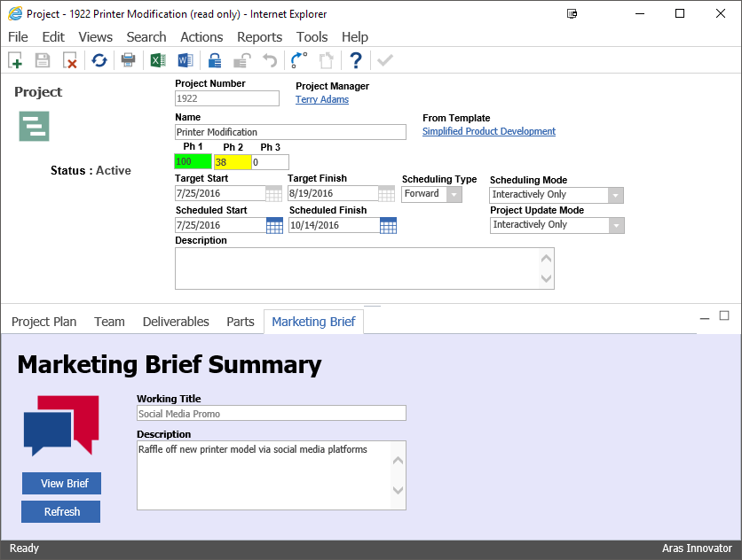

# Tab Forms

This project demonstrates how to display a custom form in a relationship tab.

## Project Details

See [TESTSTATUS file](./TESTSTATUS.md) for latest testing information.

#### Built Using:
Aras 11.0 SP7

#### Versions Tested:
Aras 11.0 SP7, Aras 11.0 SP5 (open release)

#### Browsers Tested:
Internet Explorer 11, Firefox 38 ESR, Chrome

> Though built and tested using Aras 11.0 SP7, this project should function in older releases of Aras 11.0 and Aras 10.0.

## How It Works

This package implements a use case where all Project items have an associated Marketing Brief, which is displayed in a Marketing Brief tab on the Project form.

> Note: For simplicity, the Marketing Brief tab's form is read-only, with a button to open the Marketing Brief's item form in its own window. It may be possible to create an editable tab form, but it would require additional custom code outside the current scope of this project.

The Marketing Brief is represented by the new labs_Brief ItemType. The package adds several properties to the Project ItemType: Item property `brief_id`, foreign property `brief_title`, and foreign property `brief_description`. The `brief_id` property is used to associate a Marketing Brief to a Project, and the `brief_title` and `brief_description` properties are used to display the Marketing Brief data on the tab form.

To add the Marketing Brief tab to the Project form, the package adds a "dummy" null Relationship called Project Marketing Brief. The custom labs_MarketingBriefTab form is displayed on the Project's Marketing Brief tab because the form is set as a Relationship View on the Project Brief Report RelationshipType.

Since tab forms are considered an extension of the main form, they inherit the main form's context item. In this case, that means the context item for the labs_MarketingBriefTab form is the current Project. To display the Brief's data without extra custom code, we use `brief_title` and `brief_description` from Project as data sources for the form fields.

## Installation

#### Important!
**Always back up your code tree and database before applying an import package or code tree patch!**

### Pre-requisites

1. Aras Innovator installed (version 11.0 SPx preferred)
2. Aras Package Import tool
3. TabForms import package

### Install Steps

1. Backup your database and store the BAK file in a safe place.
2. Open up the Aras Package Import tool.
3. Enter your login credentials and click **Login**
  * _Note: You must login as root for the package import to succeed!_
4. Enter the package name in the TargetRelease field.
  * Optional: Enter a description in the Description field.
5. Enter the path to your local `..\TabForms\Import\imports.mf` file in the Manifest File field.
6. Select **TabForms** in the Available for Import field.
7. Select Type = **Merge** and Mode = **Thorough Mode**.
8. Click **Import** in the top left corner.
9. Close the Aras Package Import tool.

You are now ready to login to Aras and check out the new tab form on Project.

_Note: If you have not previously done so, you will need to create a Variable called CorporateTimeZone in **Administration > Variables** and set the value to the name of your time zone (Ex: "Eastern Standard Time"). This variable is required to view or create Project items._

## Usage

1. Log in to Aras as admin.
2. Navigate to **Portfolio > Project** in the table of contents (TOC).
3. Click the **Add New** icon to start a new Project.
4. In the New Project dialog, enter a name and choose any Start Date.
5. Click the green checkmark icon to submit the dialog.
6. Click the **save** icon on the Project form to save the Project to the database and initialize the Marketing Brief.
7. Select the Marketing Brief tab.
8. Click the **View Brief** button to open the Marketing Brief's form.
9. Lock the Marketing Brief and set some text for the title and description.
10. Save, unlock, and close the Marketing Brief form.
11. Click the **Refresh** button on the Marketing Brief tab.

The Marketing Brief tab has now been updated with the current content.

## Contributing

1. Fork it!
2. Create your feature branch: `git checkout -b my-new-feature`
3. Commit your changes: `git commit -am 'Add some feature'`
4. Push to the branch: `git push origin my-new-feature`
5. Submit a pull request

For more information on contributing to this project, another Aras Labs project, or any Aras Community project, shoot us an email at araslabs@aras.com.

## Credits

Original idea and code by Peter Schroer for Aras Corporation.

Updated for Aras 11.0 by Eli Donahue for Aras Labs. @EliJDonahue

## License

Aras Labs projects are published to Github under the MIT license. See the [LICENSE file](./LICENSE.md) for license rights and limitations.
